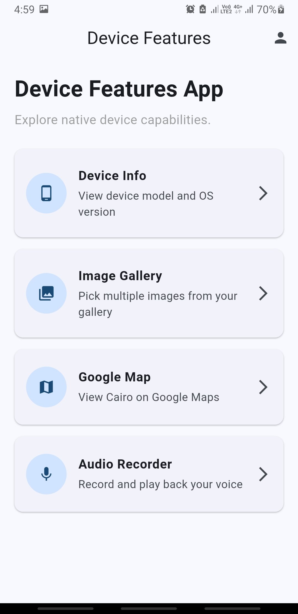
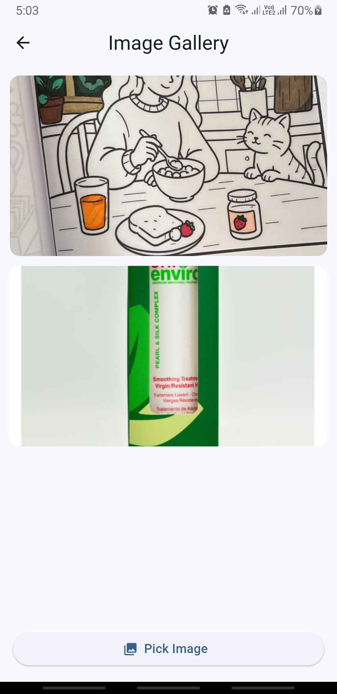
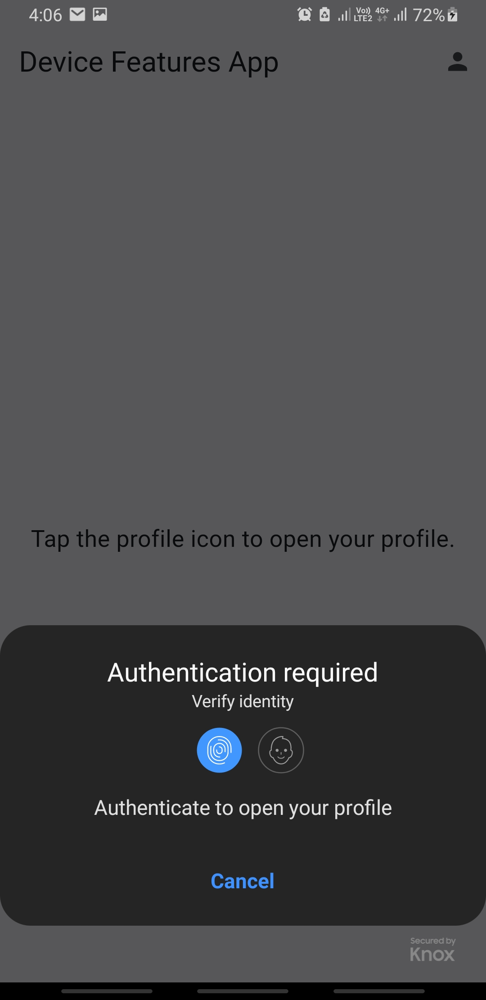
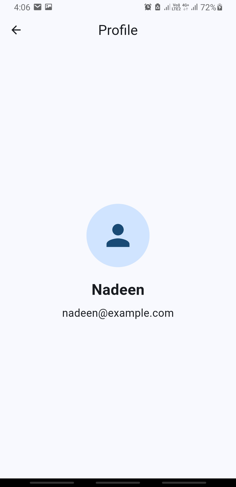
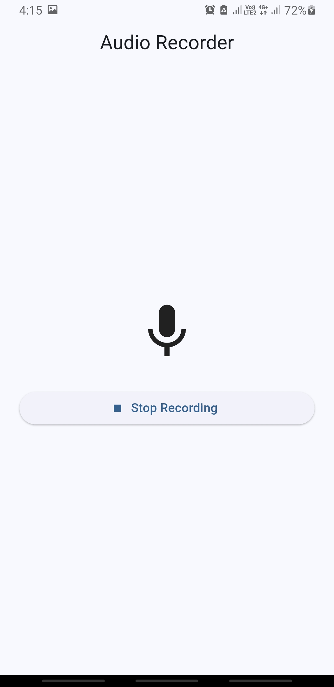
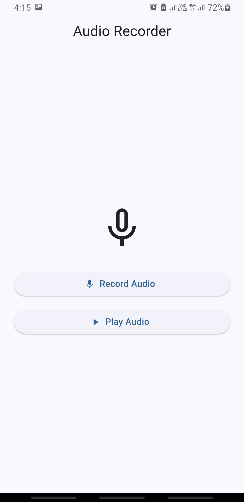

# Flutter Device Features App

A Flutter mini project that integrates native mobile device capabilities using Flutter and Dart.

## Features

- Display device model and operating system version
- Pick multiple images from the device gallery
- Display Google Maps with a marker on Cairo, Egypt
- Protect profile access using biometric authentication
- Record and play back voice audio

## Technologies Used

- Flutter SDK
- Dart
- `device_info_plus`
- `image_picker`
- `google_maps_flutter`
- `local_auth`
- `record`
- `audioplayers`
- `path_provider`

## Project Structure

```text
lib/
├── main.dart
├── screens/
│   ├── home_screen.dart
│   ├── device_info_screen.dart
│   ├── image_gallery_screen.dart
│   ├── google_map_screen.dart
│   ├── profile_screen.dart
│   └── audio_recorder_screen.dart
├── services/
│   ├── image_picker_service.dart
│   ├── biometric_service.dart
│   └── audio_service.dart
└── widgets/
    └── feature_card.dart

screenshots/
├── Screenshot 2026-09-30 201054.png
├── Screenshot 2026-09-30 201425.png
├── Screenshot 2026-09-30 201448.png
├── Screenshot 2026-09-30 221339.png
├── Screenshot_20261001-160557.jpg
├── Screenshot_20261001-160604.jpg
├── Screenshot_20261001-160615.jpg
├── Screenshot_20261001-160622.jpg
├── Screenshot_20261001-161527.jpg
├── Screenshot_20261001-161535_Permission controller.jpg
├── Screenshot_20261001-161541.jpg
└── Screenshot_20261001-161558.jpg
```

Each screen and reusable device-feature helper is kept in a separate Dart file.

---
## Home Screen

The app includes a home screen that provides navigation to all implemented device features:

- Device Info
- Image Gallery
- Google Map
- Audio Recorder
- Biometric Profile Access

The profile icon in the AppBar opens biometric authentication before allowing access to the profile page.



---

## Phase 1 — Device Info

This phase uses the `device_info_plus` package to retrieve basic device information at runtime.

The screen displays:

- Device model
- Operating system version

### Package

```bash
flutter pub add device_info_plus
```

### Permissions

No runtime permission is required to display the basic device model and operating system version used in this project.

### Screenshot


---

## Phase 2 — Media Access: Image Picker Gallery

This phase uses the `image_picker` package to allow the user to select multiple images from the device gallery.

The screen includes:

- A `ListView` for displaying selected images
- A **Pick Image** button
- Multiple image selection
- Display of selected images inside the app

The image picking logic is stored in a reusable `ImagePickerService` to keep native device integration separate from the UI and avoid duplicate code.

### Package

```bash
flutter pub add image_picker
```

### Android Permissions

No additional Android runtime permission is required for the gallery picker used in this project.

### Screenshots





> Before final submission, replace the Image Gallery screenshot with one that shows multiple selected images inside the `ListView`.

---

## Phase 3 — Google Maps and GPS

This phase uses the `google_maps_flutter` package to display Google Maps.

The Google Map screen includes:

- An AppBar titled `Google Map`
- A full-screen Google Map
- Camera positioned on Cairo Governorate, Egypt
- A red marker placed on Cairo

### Package

```bash
flutter pub add google_maps_flutter
```

### Cairo Coordinates

```text
Latitude: 30.0444
Longitude: 31.2357
```

### Google Maps API Setup

Enable:

```text
Maps SDK for Android
```

in Google Cloud Console.

The Google Maps API key is configured inside:

```text
android/app/src/main/AndroidManifest.xml
```

Inside the `<application>` tag:

```xml
<meta-data
    android:name="com.google.android.geo.API_KEY"
    android:value="YOUR_API_KEY" />
```

The real API key should not be committed publicly to GitHub.

### Permissions

No location permission is required for this implementation because the app displays a fixed marker on Cairo and does not request the user's current GPS location.

### Screenshot


> Before final submission, replace this screenshot with one where the map tiles have loaded and the red Cairo marker is clearly visible.

---

## Phase 4 — Biometric Authentication

This bonus phase uses the `local_auth` package to protect access to the user's profile page.

The app includes a profile icon in the top-right area of the home screen.

When the profile icon is tapped:

- The app checks whether biometric authentication is supported
- A biometric authentication prompt appears
- The profile page opens only after successful authentication
- Failed authentication prevents access to the profile page

The profile page displays:

- Profile image
- Full name
- Email address

The biometric logic is stored in a reusable `BiometricService`.

### Package

```bash
flutter pub add local_auth
```

### Android Permission

Add:

```xml
<uses-permission android:name="android.permission.USE_BIOMETRIC" />
```

to:

```text
android/app/src/main/AndroidManifest.xml
```

### Android Activity Configuration

`MainActivity` uses `FlutterFragmentActivity`:

```kotlin
import io.flutter.embedding.android.FlutterFragmentActivity

class MainActivity : FlutterFragmentActivity()
```

### Screenshots

#### Biometric Authentication Prompt



#### Profile Page



---

## Phase 5 — Audio Recording and Playback

This bonus phase allows the user to record voice audio and play the saved recording.

The screen includes:

- A **Record Audio** button
- A **Stop Recording** button while recording
- A **Play Audio** button after a recording exists
- Local playback of the recorded audio file

The audio logic is stored in a reusable `AudioService`.

### Packages

```bash
flutter pub add record
flutter pub add audioplayers
flutter pub add path_provider
```

### Android Permission

Add:

```xml
<uses-permission android:name="android.permission.RECORD_AUDIO" />
```

to:

```text
android/app/src/main/AndroidManifest.xml
```

### Screenshots

#### Microphone Permission


#### Recording Audio



#### Record and Play Audio



---

## Android Permissions Used

```xml
<uses-permission android:name="android.permission.USE_BIOMETRIC" />
<uses-permission android:name="android.permission.RECORD_AUDIO" />
<uses-permission android:name="android.permission.INTERNET" />

```

Google Maps also requires a valid Google Maps API key configured in the Android application.

---

## Code Quality

The project follows the required code-quality guidelines:

- Each screen is stored in its own Dart file
- Device-feature logic is separated into reusable service classes
- Clear and self-explanatory names are used for variables, methods, classes, and widgets
- Short comments explain native device-feature integration logic
- Duplicate code is avoided where possible
- Unused code is removed before submission
- Dart files are formatted before submission

---

## Running the Project

Install project dependencies:

```bash
flutter pub get
```

Run the app:

```bash
flutter run
```


## GitHub

Public GitHub Repository:

```text
https://github.com/NadeenXo/device-features-app.git
```
